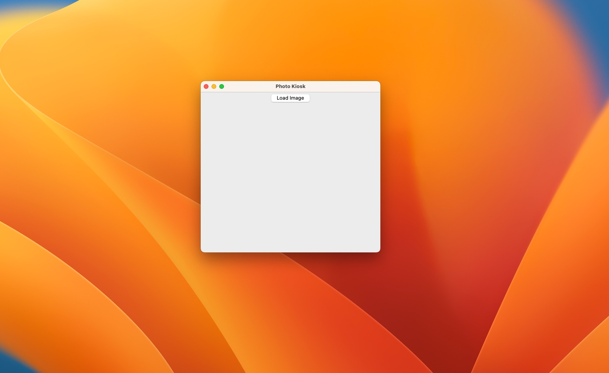
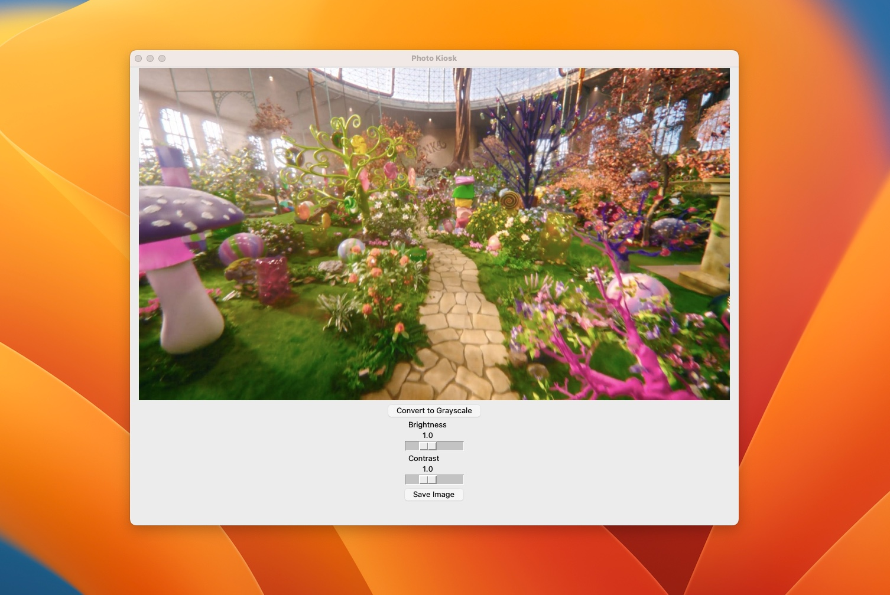
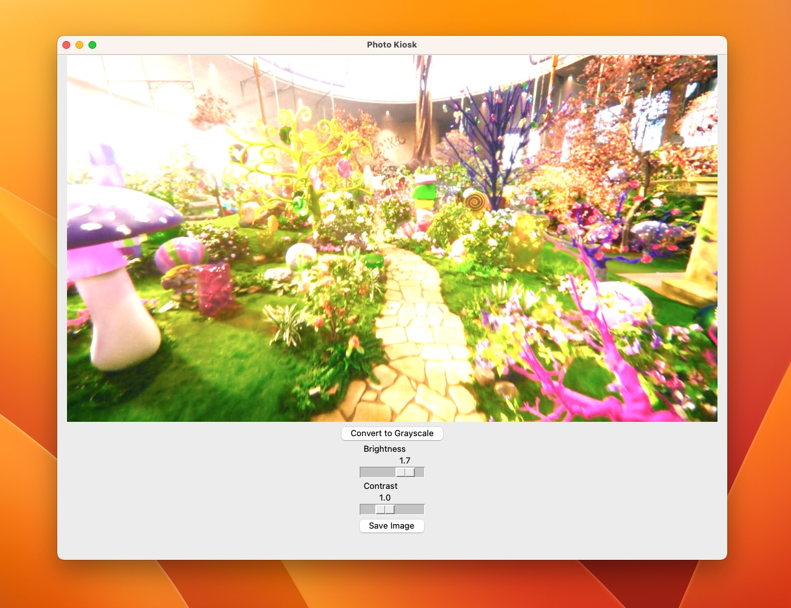
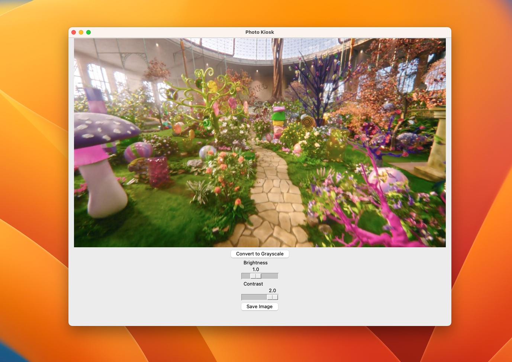
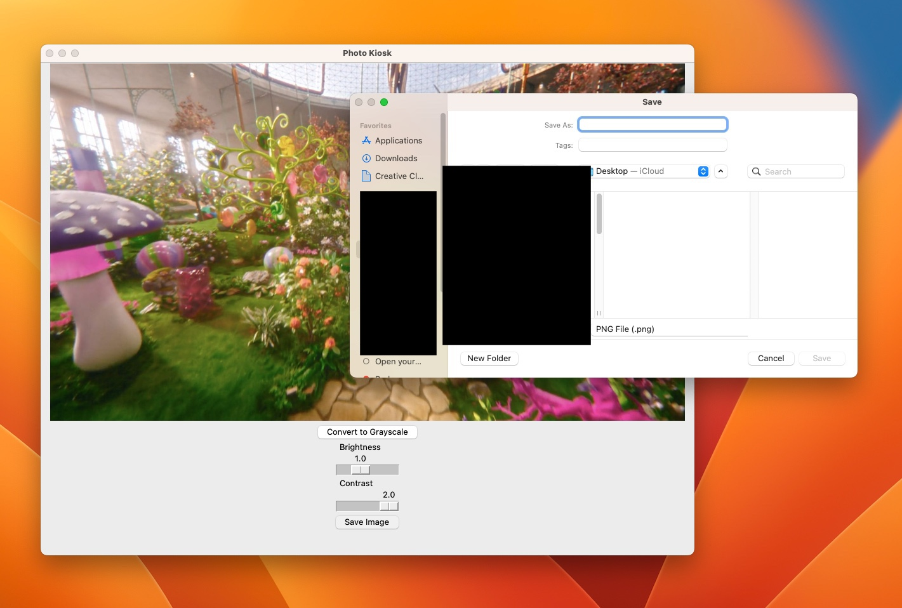

## :camera: Photo-Editor :camera:

This project was practice with using Pillow, TKinter, and all of their packages. This was a fun application to build because I didnt know just how versatile TKinter is. I also got more practice with classes and methods. Overall this was an enriching experience. I got to make an app with Sliders! 🤩

Main Menu

Load Image

Brightness

Contrast

Save

